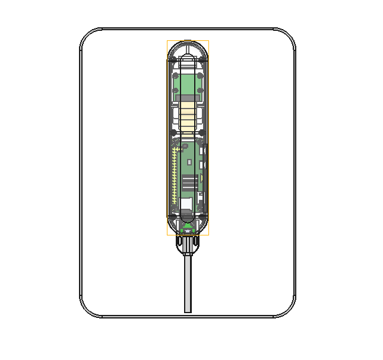
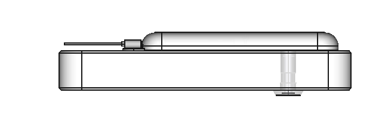
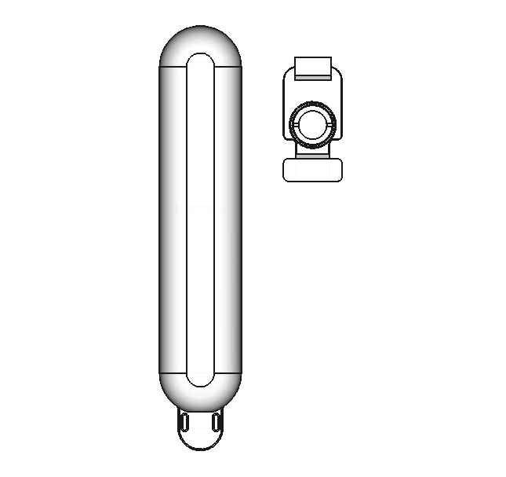

# Peepcam

Peepcam is a simple Peephole Camera device to use inside the house since it is stupid to keep an expensive device hanging outside of your house so everyone around will know you have interesting stuff to protect.

Front view (from inside the home)

<p align="center">
	
	
</p>


Side view

<p align="center">
	
	
</p>

Isometric view

<p align="center">
	
</p>

# Device usage

The Peephole and the Door-Hook are fixed on the Door using the existing hole of the Peephole. Then the device is mounted on top of it. It can be easily detached to access the peephole as is shown in the following picture if needed.

<p align="center">
	
</p>

# Bill of Materials

The image shows the main parts of the device.

<p align="center">
	
</p>

Of-the-Shelf Parts

| Part                            | Qty |
| ------------------------------- | --- |
| Gold Peephole                   | 1   |
| Raspberry Pi Zero W             | 1   |
| Raspbery Pi Camera Board 1.3    | 1   |
| Ribbom-Cable (Arducam UC-665)   | 1   |
| Micro SD Card (Class 10)        | 1   |
| Heat Sink 14x14x6               | 1   |
| USB Micro-B Breakout Board      | 1   |
| Micro USB Power Adapter > 370mA | 1   |

Fasteners

| Part           | Size | Lenght | Type    | Qty |
| -------------- | ---- | ------ | ------- | --- |
| M2-Nut         | M2   |        | ISO4032 | 2   |
| M2x4-Screw     | M2   | 4	     | ISO4762 | 4   |
| M2x5-Screw     | M2   | 5	     | ISO4762 | 8   |
| M2.5x5-Screw   | M2.5 | 5	     | ISO4762 | 4   |

Housing (3D-printables)

| Part           | Qty |
| -------------- | --- |
| Door-Hook      | 1   |
| Base           | 1   |
| Camera-Mount   | 1   |
| Lid            | 1   |

# Software

I am using `Raspbian GNU/Linux 11 (bullseye)` as the Operating System.

Also, to detect motion, I am currently using [Motion 4.4.0](https://github.com/Motion-Project/motion) whichsends data (picture and video) to a [Telegram Bot](https://www.freecodecamp.org/news/how-to-create-a-telegram-bot-using-python) that sends push notifications to the smartphone.

The script to send data to the Telegram Bot using the `code/cfg/telegram/credentials.json` file. A sample of the file is shown bellow.

```json
{
	"apiToken": "[API_TOKEN]",
	"chatID": "[CHAT_ID]",
	"peepcam_local_url": "[LOCAL_HOSTNAME_OR_IP_AND_PORT]",
	"peepcam_external_url": "[EXTERNAL_DNS_AND_PORT]"
}
```
