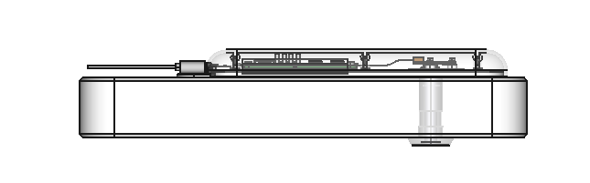

# Peephole Cam

Simple Peephole Camera to use inside the house since it is stupid to keep an expensive device hanging outside of your house so everyone around will know you have interesting stuff to protect.

# Bill of Materials

Of-the-Shelf Parts

| Part                            | Qty |
| ------------------------------- | --- |
| Gold Peephole                   | 1   |
| Raspberry Pi Zero W             | 1   |
| Raspbery Pi Camera Board 1.3    | 1   |
| Ribbom-Cable (Arducam UC-665)   | 1   |
| Micro SD Card (Class 10)        | 1   |
| Heat Sink 14x14x6               | 1   |
| USB Micro-B Breakout Board      | 1   |
| Micro USB Power Adapter > 370mA | 1   |

Fasteners

| Part           | Size | Lenght | Type    | Qty |
| -------------- | ---- | ------ | ------- | --- |
| M2-Nut         | M2   |        | ISO4032 | 2   |
| M2x4-Screw     | M2   | 4	     | ISO4762 | 4   |
| M2x5-Screw     | M2   | 5	     | ISO4762 | 8   |
| M2.5x5-Screw   | M2.5 | 5	     | ISO4762 | 4   |

Housing (3D-printables)

| Part           | Qty |
| -------------- | --- |
| Door-Hook      | 1   |
| Base           | 1   |
| Camera-Mount   | 1   |
| Lid            | 1   |
